# Hi, I'm Munhangyeol
---

## Summary

Backend Engineer specializing in **Distributed Systems**, **Messaging Architecture**, and **Infrastructure Automation**.

I focus on building **reliable backend platforms** and solving **real-world performance and scalability problems**.

- Backend Engineer @ **SECUI**
- Experienced in **Spring Boot, Python (Flask), Redis, Celery, Elasticsearch**
- Interested in **Large Scale System Architecture** and **High-Performance Backend Systems**

**Tech Blog**  
https://velog.io/@msw0909/posts  

**Email**  
mhg10181018@gmail.com

---

##  Recent Technical Focus
### Backend Engineering

Recently reinforced backend fundamentals with a focus on **code quality, maintainability, and design principles**.

- Explored what **"pythonic code"** means in practice (readability, simplicity, and consistency)
- Applied pythonic design principles to improve backend code readability and maintainability
- Applied **SOLID principles** in Java and Spring-based backend development
- Improved code structure through proper layering, dependency management, and interface-based design
- Focused on writing maintainable and scalable backend services rather than only implementing features
---

### Frontend Ecosystem

Recently expanded frontend capability using Vue ecosystem:

- Experienced with Vue 2 and Vue 3 architecture differences  
- Build tool understanding:
  - Vite (Dev Server + Modern Build Pipeline)
  - Webpack (Legacy Enterprise Build Systems)
  - Rollup (Library / Plugin Bundling Optimization)

Able to understand and collaborate on full frontend build pipelines and performance optimization.

---

###  AI / Agent Workflow Automation

Experienced in applying Claude AI for development workflow automation.

- Designed and maintained **Claude Skills** for reusable development workflows  
- Built **Agent-based automation flows** for coding and debugging tasks  
- Authored **CLAUDE.md** to standardize AI collaboration context and improve response quality  
- Applied AI-assisted development for code generation, debugging, and architecture design support  

Focus area:
- AI-assisted Development Workflow
- Agent-based Coding Automation
- Prompt Engineering for Stable Output

---

##  Education

**Sejong University** — Software Engineering  
(2019.03 ~ 2025.02)

**Samsung SSAFY 13th**  
(2025.01 ~ 2025.07)

---

##  Open Source Contributions

### JabRef
Contributed to stability, dependency compatibility, and library upgrades.

- CSL Format Test Fix (https://github.com/JabRef/jabref/pull/13465)  
- Dependency Compatibility Fix (https://github.com/JabRef/jabref/pull/13511)  
- okhttp Version Upgrade  (https://github.com/JabRef/jabref/pull/13521)  

**Repository**  
https://github.com/JabRef/jabref  

---

##  PS(Problem Solving)

----

##  Personal

